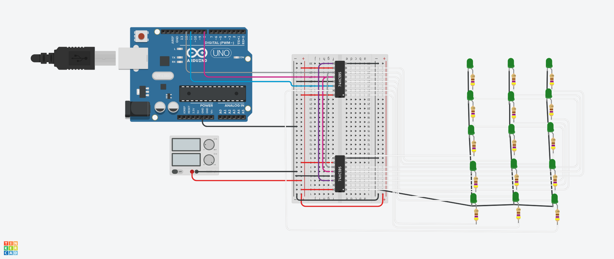

# embedded_595_15LED_counter
My First project on GitHub with embedded to test 74HC595N start date 04.04.2024

This code it is intended for PlatformIO, if you are using ArduinoIDE it will be enough just to open "CodeFile-for-ArduinoIDE.ino" file in Arduino ide.

Code Description:

This code is intended for displaying digits from 0 to 9 on a set of LEDs controlled by two 74HC595 shift registers. The LEDs are connected in a 5x3 matrix, and each digit is represented by a specific LED matrix. The LED matrix is defined for each digit from 0 to 9. To ensure correct display, the LEDs must be connected in mirror, so that the last pin is the first LED.

Pin Configuration:

-latchPin: Pin for controlling the output latch of the shift register (ST_CP)
-clockPin: Pin for the clock signal (SH_CP)
-dataPin: Pin for data (DS)

Main Functions:

-sendBit(int bit): Function to send a bit to the shift register.
-sendData(int ledState): Function to send a byte to the 74HC595 to control the LED states.
-displayDigit(int digit): Function to display a specific digit on the LEDs using the corresponding matrix.

Setup and Main Loop:

-In the setup() function, control pins are set as outputs, and serial communication is initialized at 9600 baud.
-In the loop() function, it iterates from 0 to 9, and each digit is displayed on the LEDs with a delay of 1 second between each display.
This configuration and functionality allows for sequential display of digits on LEDs without using serial input.

Link to TinkerCAD -> https://www.tinkercad.com/things/52jVeVKwmmL-frantic-jaban/editel?sharecode=e2cEcgFiD7B4mP9ZbcmDPOyDTj1b-XN3_OpPorSRiVk

The code it is updated and fully functional -> date : 05.04.2024

